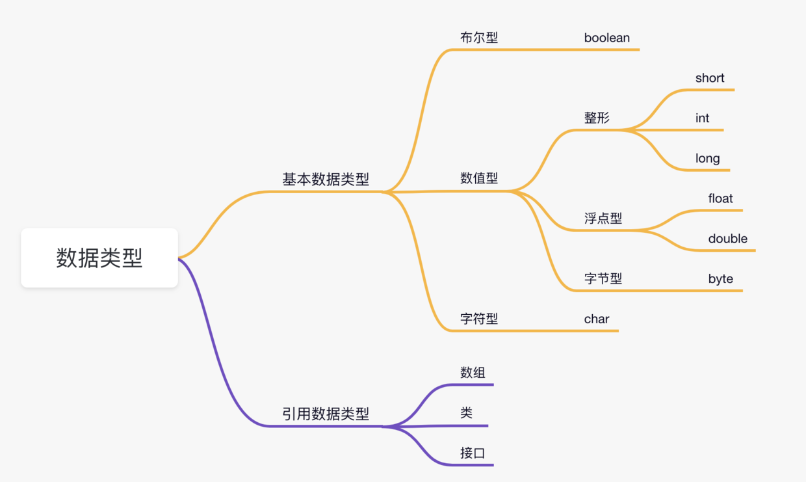
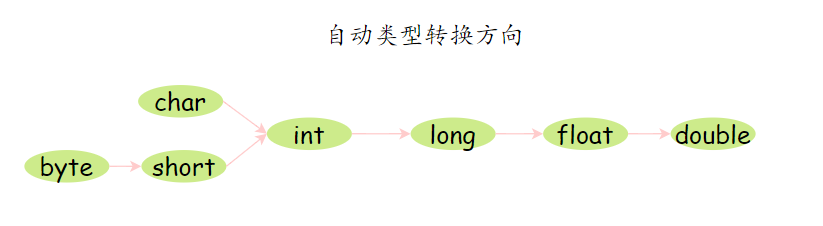
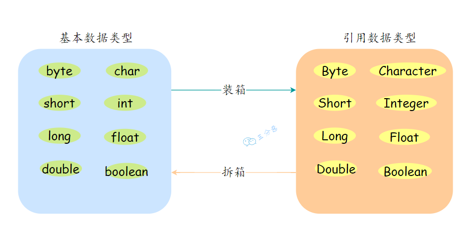
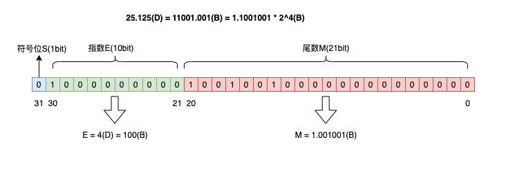

# 基础语法
--------

# 2.Java 语言有哪些特点？
1. 面向对象：封装、继承、多态
2. 平台无关：JVM 保证很好的可移植性
3. 支持多线程：C++ 语言没有内置的多线程机制，因此必须调用操作系统的 API 来完成多线程程序设计，而 Java 却提供了封装好多线程支持；
4. 编译与解释并存：
   1. 纯编译语言：编译器针对特定的操作系统，将源代码一次性翻译成可被该平台执行的机器码。示例：C、C++、Rust、Go。优点：高性能；缺点：平台依赖。
   2. 纯解释语言：解释器对源代码进行逐行解释，解释成特定平台的机器码并执行。示例：Python。优点：易调试、平台无关；缺点：执行慢。
   3. 混合模式（编译与解释并存）：先编译成中间码（如字节码），然后由虚拟机解释执行，并用JIT（即时编译）优化热点代码。示例：Java（JVM + JIT）、JavaScript（V8引擎 + JIT）、C#（.NET CLR + JIT）。优点：平衡性能和可移植性。

# 7.🌟Java 有哪些数据类型？

Java 的整数类型采用的是二进制补码表示法，溢出时值会变成最小值。

# 8.自动类型转换、强制类型转换了解吗？
一个范围较小的数值或变量赋给另外一个范围较大的变量时，会进行自动类型转换；反之，需要强制转换。

# 9.什么是自动拆箱/装箱？

# 13.用效率最高的方法计算 2 乘以 8？
2 << 3。位运算，数字的二进制位左移三位相当于乘以 2 的三次方。

# 自增
在Java中，i = i++ 的行为是：

先计算右侧 i++：返回 i 的当前值（1），然后 i 自增到2。
再将返回的值（1）赋值给左侧的 i，覆盖掉自增后的值。
所以 i 最终还是1，打印结果为1。

# 15.float 是怎么表示小数的？
float 表示小数的方式是基于 IEEE 754 标准。      
V = (-1)^S * M * R^E        
为了节省空间，以及二进制的最简短表示，即省略前边所有0 ，所有的二进制除了0都是由 1 开头的，因此首位的1可以省略不写。     
用二进制科学计数法表示：25.125(D) = 11001.001(B) = 1.1001001 * 2^4(B)       
所以符号位 S = 0，尾数 M = 1.001001(B)，指数 E = 4(D) = 100(B)      

补充：由于小数部分转化为二进制是 不断乘 2 直到 没有小数部分，以及尾数位有限，这也就导致出现循环后被切断，浮点数会有精度丢失的风险。

# 如何保证高的 数据准确性（金融领域）
由上所述，浮点数 float 和 double 肯定不行了，在金融计算中，保证数据准确性有两种方案，一种使用 BigDecimal，一种将浮点数转换为整数 int 进行计算。    

在处理小额支付或计算时，通过转换为较小的货币单位（如分），这样不仅提高了运算速度，还保证了计算的准确性。

# 面向对象

# 18.🌟面向对象编程有哪些特性？
- 封装：将数据 的属性与 行为（方法）封装在一个对象中（类实例）
- 继承：子类可以继承父类的 属性和方法，是代码可复用性的体现
- 多态：基于继承，多个子类可以重写父类/接口的方法，父类引用指向不同子类的不同实现，同样的方法名实现多态

# 多组合少继承？
“组合”（composition）主要指对象的组合——也就是一个对象通过持有（引用）其他对象来获得或委托行为，而不是通过继承来获取行为。

- 继承表达的是“是一种（is-a）”关系，组合表达的是“有/使用（has-a / uses-a）”关系。很多情况下实际关系更贴近“有”而不是“是”。
- 继承会在子类和父类之间引入紧耦合，破坏封装，导致难以维护和扩展。组合通过将行为委托给内部对象，能更好地封装变化点和职责划分。
- 组合更灵活：运行时可以替换、组合不同策略；继承的行为在编译时就固定了（静态继承层次难以动态改变）

组合更加灵活，而且适用于业务中用来表示 有/have 的概念，而继承更适合表示 是/is 的概念。比如游戏设计 中的 Buff，有可以造成伤害 的 buff ，有 可以提供增益 的buff，但是武器和道具也可以造成伤害 和 提供增益 ，这部分是有 可以复用的地方，也体现了 have 这个概念，所以我们可以把造成伤害 和 提供增益 抽象成接口，由 buff 和 武器道具 去 实现。

# 19.多态解决了什么问题？

