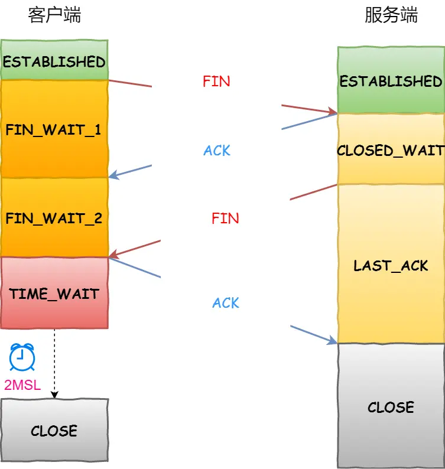

# 三次握手
目的：建立连接
## 连接的定义
连接就是一组 状态信息，包括 （sockets、seq、window size），用于保证可靠性和流浪控制维护。  
- sockets：由IP 和 端口号 组成
- seq：序列号，用来解决乱序问题
- window size：做流量控制

由 四元组 确定一个 连接

## 过程

# 四次挥手

双方均可主动断开连接：双方均收发一对：Ack / Fin

# 重传机制、滑动窗口、流量控制、拥塞控制
## 重传
通过 ack 的数值知道对方收到了哪些 seq 包
长时间没收到对方的 消息，就会重新发送

## 流量控制
重传对性能影响比较严重，流量控制用来尽量避免重传。  
TCP 根据 接收/发送 窗口大小 控制发送的数据量/

## 滑动窗口
流量控制中，窗口长度是动态变化的。

## 拥塞控制
有时候丢包不是因为收发双方能力，而是网络环境拥塞。  
TCP通过逐渐加大数据量直到出现丢包，来测试当前网络环境能处理的最大数据量。