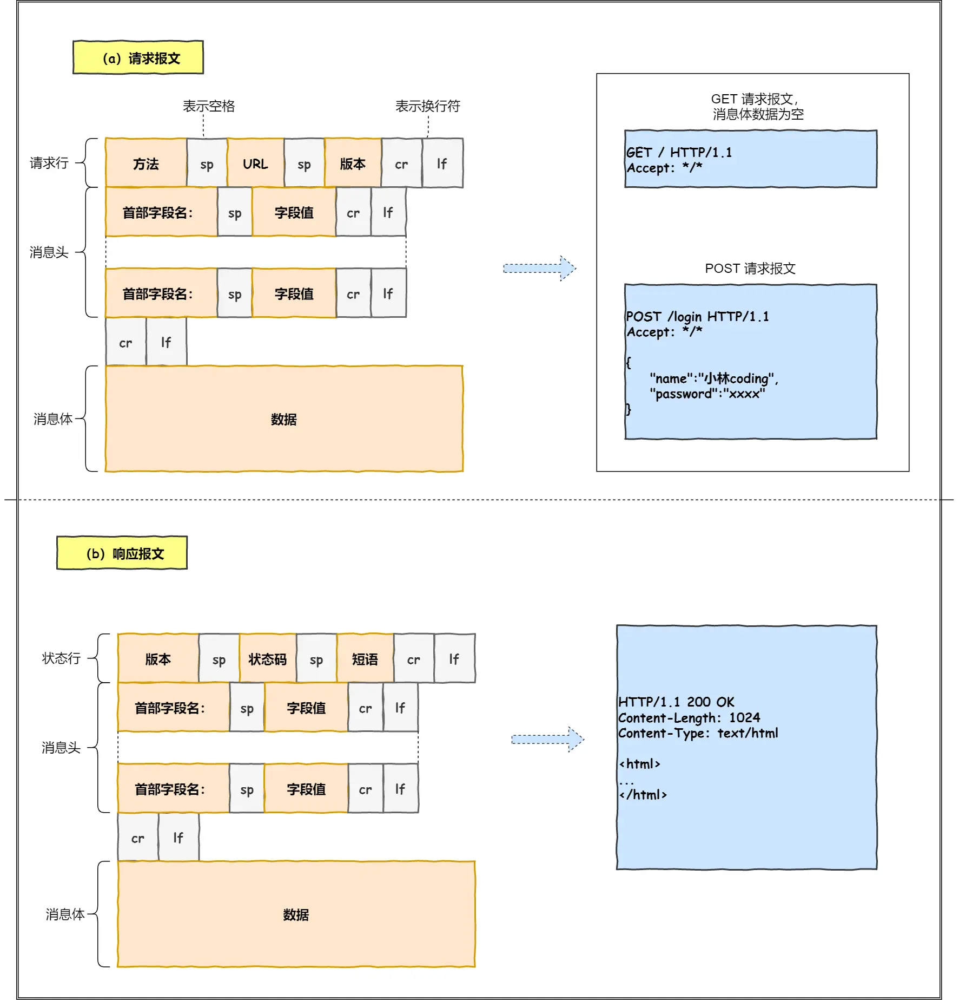
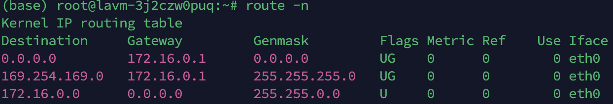
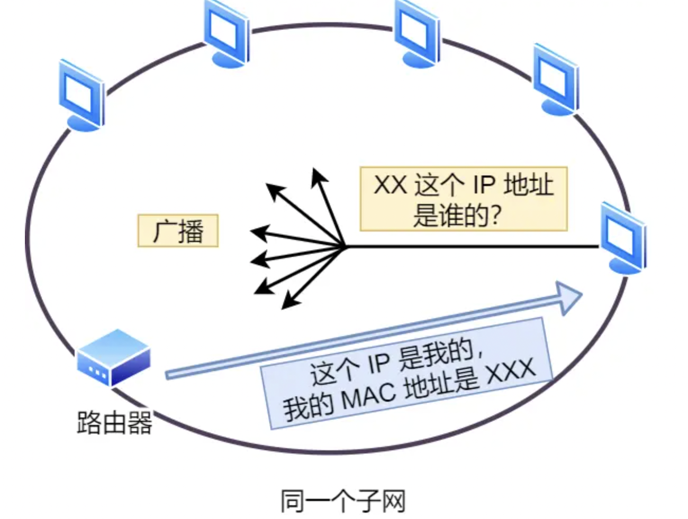
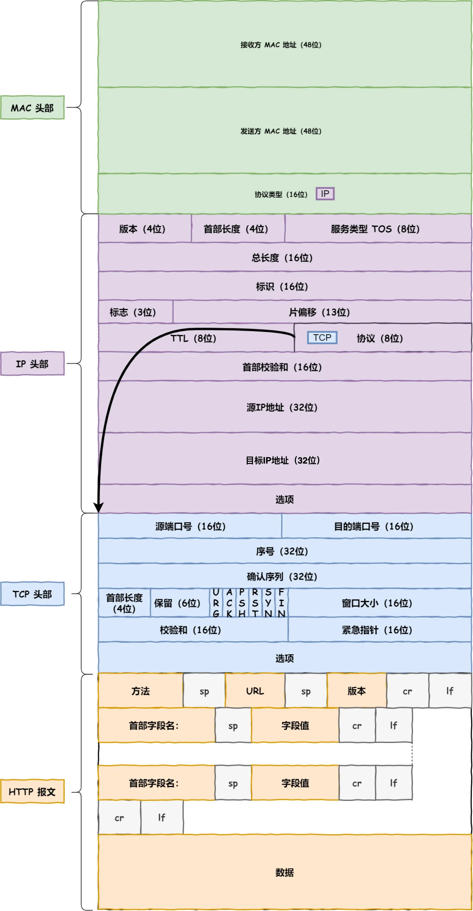
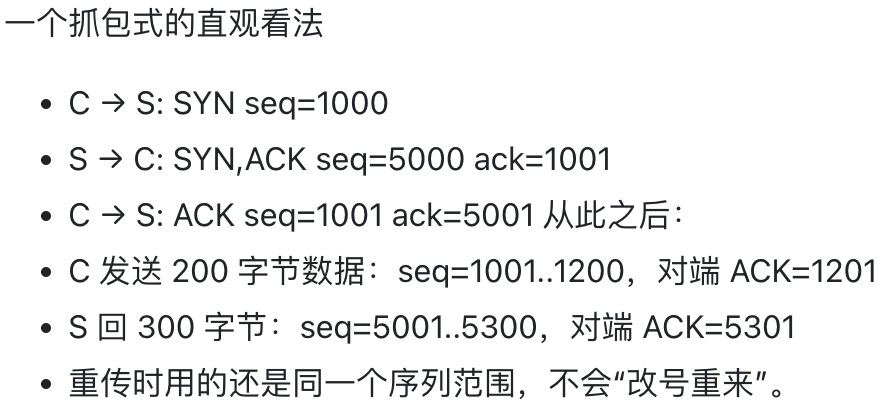

# 向浏览器键入 URL 后 一次网络通信 发生的事
浏览器解析 服务器域名 要访问的 路径 ， 携带的参数  
⬇️  
## 利用DNS 解析 域名 ：  
浏览器缓存 ➡️ 操作系统缓存 ➡️ host文件 ➡️ DNS 服务器 ：  
.根域名服务器（每个DNS服务器都会保存根域名服务器信息）➡️  
.com 顶级域名服务器
server.com 权威域名服务器 ➡️ 返回给 浏览器 对应服务器的 IP 地址
## 应用层（用户态）
生成 HTTP 请求消息

## TCP
浏览器监听端口号（一般随机生成）  
服务器监听端口号（HTTP默认端口号：80，HTTPs默认端口号：443）
## IP
目标IP  
源IP  
协议号： TCP/UDP

### 源IP 的选择
目标IP 与 路由表中的 子网掩码 做 与运算， 再与路由表中对应的 destination IP 匹配，成功则使用对应 IP 作为 源 IP 。  
 
最终 一定会 匹配 0.0.0.0

## MAC
接收方MAC地址（48位）
发送方MAC地址（48位）
协议类型（16位 IP/ARP）  
### **如何获取 对方 MAC 地址？
通过 查找路由表中匹配的条目 得到 Gateway 地址 知道了 下一步 发送的 路由器的 IP地址。  
⬇️  
通过ARP 协议 找到路由器的 MAC 地址（有 ARP 缓存）

# 至此，网络包的报文如下图

# 网卡
网络包 只是 存放在内存中的 一串 二进制数字信息。  
由网卡 将数字信息转换为 电信号。  
网卡 由 网卡驱动程序 控制。  
网卡驱动 获得 网络包后，复制其 至 网卡内的 缓存区，并在其 开头 加上 报头 与 起始帧分界符，在结尾加上 用于 检测错误 的 帧校验序列（FCS）。  
最后，由网卡 将 包 转换为 电信号，通过网线等 设备传输出去。
# 交换机
交换机的端口 本身没有 MAC 地址
交换机 的 MAC 地址表 记录了 子网内设备（计算机、路由器）的 MAC 地址 以及对应设备 在交换机上的 端口号 。  
如果表中没有查到 目标 MAC 对应的 端口，则广播，得到回应后 则写入MAC地址表。  
以及 ，接收方 是 广播地址也会触发交换机 的 广播。
# 路由器 （开始脱离子网）
路由器负责将数据包转发到下一个路由器或者 目标设备。  
路由器的每个端口都有MAC地址（可以成为以太网的接收方和发送方） 和 IP地址（和计算机网卡是一样的）。  
同样路由表查询转发目标。

网络传输过程，源IP 和 目标IP 一直不变，变的是MAC地址。

# 服务器 与 客户端 信息解析

