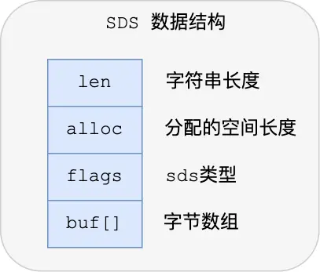

# 简直对数据库的实现
Redis中 key 就是字符串对象，value 可以是字符串对象，也可以是集合数据类型的对象。    

Redis使用哈希表保存所有健值对 对象。    

# SDS（simple dynamic string，SDS）
C 语言字符串以 “\0"字符作为结束标识，因此字符串中不能出现“\0" ，这个限制使得 C 语言的字符串只能保存文本数据，不能保存像图片、音频、视频文化这样的二进制数据。   
    
其中 buf 保存真实数据。     

