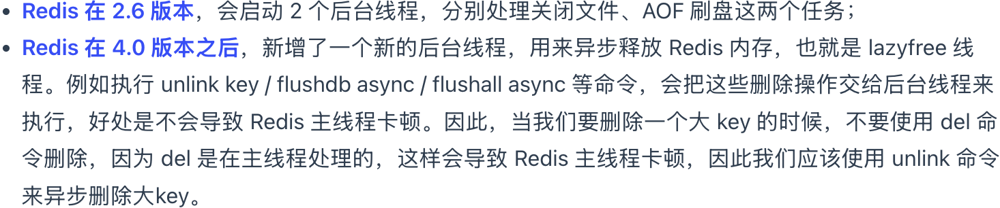

# Redis 是单线程吗？
Redis 单线程指的是「接收客户端请求->解析请求 ->进行数据读写等操作->发送数据给客户端」这个过程是由一个线程（主线程）来完成的，这也是我们常说 Redis 是单线程的原因。      
但是Redis 程序并不是单线程的，Redis 在启动的时候，是会启动后台线程（BIO）的。   
Redis 为「关闭文件、AOF 刷盘、释放内存」这些任务创建单独的线程来处理。

# 为啥单线程还这么快？
- 内存
- 避免多线程切换的开销，以及死锁
- IO 多路复用

# 6.0 之前为啥使用单线程？
作者认为Redis的 瓶颈不在于 CPU，而是内存大小 和 网络带宽，因此使用单线程没什么问题并且可维护性高。

# 6.0 之后为什么引入了多线程？
在 Redis 6.0 版本之后，也采用了多个 I/O 线程来处理网络请求，这是因为随着网络硬件的性能提升，Redis 的性能瓶颈有时会出现在网络 I/O 的处理上。     
所以为了提高网络 I/O 的并行度，Redis 6.0 对于网络 I/O 采用多线程来处理。但是对于命令的执行，Redis 仍然使用单线程来处理。        
Redis 6.0 版本之后，Redis 在启动的时候，默认情况下会额外创建 6 个线程：     
- Redis-server ： Redis的主线程，主要负责执行命令；
- bio_close_file、bio_aof_fsync、bio_lazy_free：三个后台线程，分别异步处理关闭文件任务、AOF刷盘任务、释放内存任务；
- io_thd_1、io_thd_2、io_thd_3：三个 I/O 线程，io-threads 默认是 4 ，所以除了主线程外额外启动三个 IO线程。