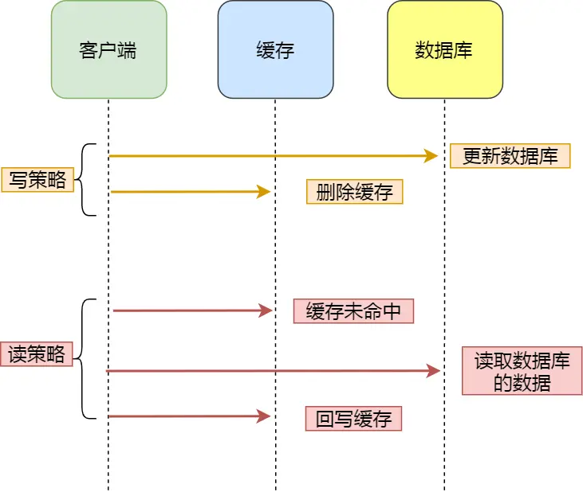

缓存雪崩、缓存击穿、缓存穿透        

# 缓存雪崩
大量缓存数据在同一时间过期（失效）。如果此时有大量的用户请求，都无法在 Redis 中处理，于是全部请求都直接访问数据库，从而导致数据库的压力骤增，严重的会造成数据库宕机，从而形成一系列连锁反应，造成整个系统崩溃，这就是缓存雪崩。

## 解决方法

- 将缓存失效时间随机打散
- 设置缓存不过期

# 缓存击穿
某个热点数据过期，也会造成大量数据直接请求到数据库。数据库很容易就被高并发的请求冲垮，这就是缓存击穿的问题。

## 解决方法
可以认为缓存击穿是缓存雪崩的一个子集。
- 互斥锁方案：同一时间只有一个业务线程请求缓存（Redis 中使用 set NX 方法设置一个状态位，表示这是一种锁定状态）。  先查缓存未命中→尝试加锁→加锁成功后再次查缓存（可能已被他人填充）→再决定是否重建。   
- 不给热点数据设置过期时间，由后台异步更新缓存，或者在热点数据准备要过期前，提前通知后台线程更新缓存以及重新设置过期时间；

# 缓存穿透
缓存雪崩或击穿 ，数据库中保存了数据，可以重建缓存，但如果数据库中无数据，查询“根本不存在”的数据，就是缓存穿透。     
触发源：恶意爬虫/攻击、参数越界（非法 ID）、数据一致性缺陷（逻辑已删除但缓存策略未存空值）。
## 解决方法
- 空值写入缓存
- 多级缓存，本地缓存等
- 参数校验与限流
- 布隆过滤器

# 如何设计一个缓存策略，可以动态缓存热点数据呢？
存储受限，只能将一部分热点数据放入缓存，如何动态判断？      
总体思路：通过数据最新访问时间来做排名，并过滤掉不常访问的数据，只留下经常访问的数据。

## 常见的缓存更新策略？
常见的缓存更新策略共有3种：

- Cache Aside（旁路缓存）策略；
- Read/Write Through（读穿 / 写穿）策略；
- Write Back（写回）策略；

实际开发中，Redis 和 MySQL 的更新策略用的是 Cache Aside，另外两种策略应用不了。     
### Cache Aside（旁路缓存）策略
- 写策略的步骤：
    - 先更新数据库中的数据，再删除缓存中的数据。
- 读策略的步骤：

    - 如果读取的数据命中了缓存，则直接返回数据；
    - 如果读取的数据没有命中缓存，则从数据库中读取数据，然后将数据写入到缓存，并且返回给用户。

