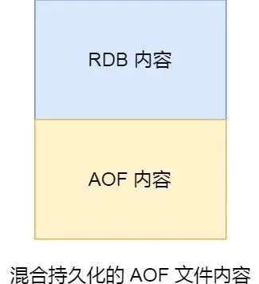

# Redis 共有三种数据持久化的方式：
- AOF 日志：每执行一条写操作命令，就把该命令以追加的方式写入到一个文件里；
- RDB 快照：将某一时刻的内存数据，以二进制的方式写入磁盘；
- 混合持久化方式：Redis 4.0 新增的方式，集成了 AOF 和 RDB 的优点；

# AOF 日志持久化
将 每一条 写命令 都记录到一个日志文件中。       
执行 写命令 成功后 写入 到 AOF 中，好处是避免了额外的检查开销，比如错误指令，其次不会阻塞当前的写入命令。   
不好处就是有了丢失的风险，比如刚执行完写命令，断电了，这个命令没有被记录到AOF文件中，也就没有实现持久化。而且可能阻塞下一条 的写命令      

其中 第一行表示 命令 有三个部分，$数字 表示接下来的命令 部分 的字节数。     

## AOF 的三种写回策略
首先，Redis 写入 AOF 日志的过程：       
        
对应，在 Redis.conf 配置文件中的 appendfsync 配置项可以有以下 3 种参数可填：        

## AOF 重写机制
AOF文件过大时触发。Redis 的重写 AOF 过程由后台子进程 bgrewriteaof 来完成。     
只保留value最新状态的 写命令。      
在重写 AOF 期间，当 Redis 执行完一个写命令之后，它会同时将这个写命令写入到 「AOF 缓冲区」和 「AOF 重写缓冲区」。
子进程重写完之后，主进程将AOF重写缓冲区 的内容加入到 AOF 文件中。

# RDB 快照实现
Redis 提供了两个命令来生成 RDB 文件，分别是 save 和 bgsave，区别在于 前者在 主线程中执行，后者会创建一个子进程。

## RDB 在执行快照的时候，数据能修改吗？
可以 ，写时复制技术（Copy-On-Write, COW）。     

# 混合式
考虑之前二者的缺点：        
- AOF 恢复慢
- RDB 保存慢    

        
减少 RDB 频率， 用 AOF 来保存 更新的 数据状态。
