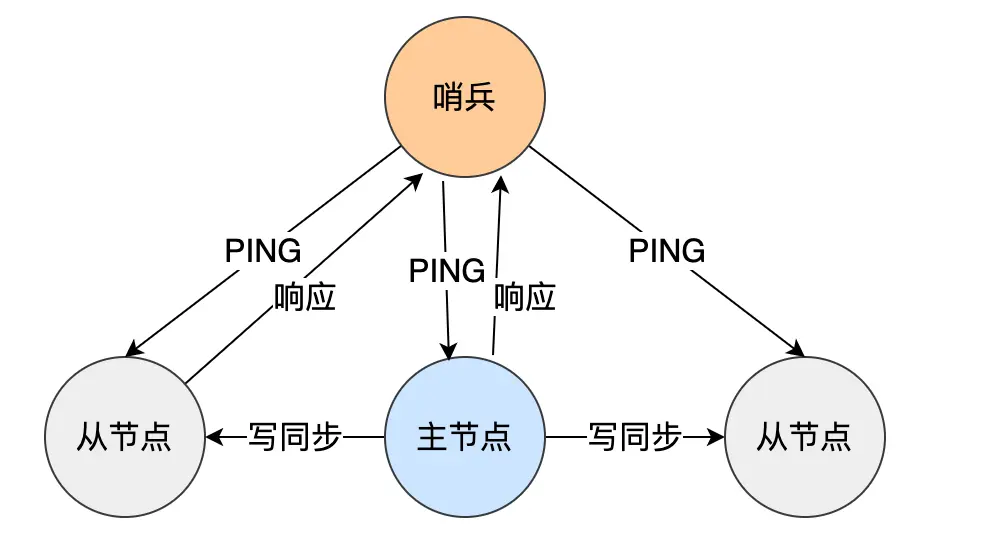
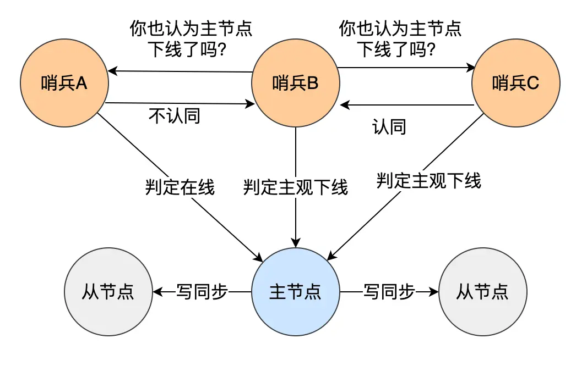

# 哨兵（Sentinel）机制
哨兵模式做到了可以监控主从服务器，并且提供主从节点故障转移的功能。      
它会监测主节点是否存活，如果发现主节点挂了，它就会选举一个从节点切换为主节点，并且把新主节点的相关信息通知给从节点和客户端。
    
哨兵节点主要负责三件事情：监控、选主、通知.     

ping不通则认为 主观下线，但实际主节点可能只是发生了网络拥堵。因此多设置几个哨兵节点协同，防止误判，实现客观下线。       
        
