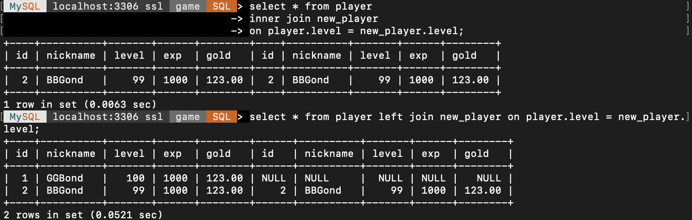

# 一些数据库操作
````SQL
SHOW DATABASES; -- 输出所有的数据库
USE database_name; -- 使用 指定 的数据库
SHOW TABLES; -- 输出数据库中的所有表
DESC table_name; -- 描述表结构
CREATE DATABASE database_name; -- 创建数据库
DROP DATABASE database_name; -- 删除数据库
MYSQLDUMP -u user_name -p database_name table_name -> name.sql; -- 表名可省略,导出数据库数据 至 指定文件
MYSQL -u user_name -p database_name < name.sql -- 导入数据到指定数据库
````

# 一些表操作


# 增删改查
WHERE 均可省略
## 插入一/多条数据
````sql
INSERT INTO table_name (column_name0,column_name1...) VALUES (对应 字段 的值),(...),(...);
````
##  查询数据
````sql
SELECT * FROM table_name WHERE 条件语句; -- SELECT 后边表示 要展示的 字段，或基于字段的 计算、统计值，包括表达式、聚合函数
````
##  更新数据
````sql
UPDATE table_name SET column_name = new_value WHERE 条件语句;
````
## 删除数据
````sql
DELETE FROM table_name WHERE 条件语句;
````

# 一些常用语句
````sql
-- 用于 WHERE 条件语句中
-- 条件 与或
AND
OR
IN (... , ...)  -- 是否存在范围中
BETWEEN ... AND ... -- 表示一个范围

NOT -- 取反
IS NULL -- 判空 ，IS NOT NULL

-- 排序
ORDER BY column_name -- 按指定列 升序排序
ORDER BY column_name DESC -- 按指定列 降序排序

-- 去重
SELECT DISTINCT column_name FROM ...;

-- 连接
-- 并集
UNION -- 合并两个查询结果
UNION ALL -- 可以重复输出 满足两个语句的 同一条数据
-- 交集
INTERSECT 
-- 差集
EXCEPT

-- 通配符，详细见下文图片
LIKE -- 通配符匹配 % ：任意数量字符，_ : 一个字符。 WHERE name LIKE 'GGBon_' or name LIKE 'GG%'
REGEXP -- 正则表达式。WHERE name REGEXP '[GBn]'

-- 聚合函数，详细见下文图片
SELECT COUNT(*) FROM database_name; -- 统计数据量
SELECT AVG(column_name) FROM database_name; -- 针对列 计算 均值

GROUP BY -- 针对字段值分类聚合，结合聚合函数使用，比如统计不同等级数据量：SELECT level ,COUNT(level) FROM tableName GROUP BY level;

HAVING -- 用来对 检索结果进行 过滤，比如检索 level 大于 4:  SELECT level ,COUNT(level) FROM tableName GROUP BY level HAVING COUNT(level) > 4;
-- 以及可以结合 ORDER BY 排序 

LIMIT -- 限制输出，LIMIT 3; 表示输出 3 条数据；或者， LIMIT 偏移量/偏移起始位置 , 返回数量，即 ： LIMIT 3,4; 表示从 3 开始，总共返回 4 条数据。 ** 这也是分页查询原理**
````
## 正则表达式通配符

## 聚合函数


# 子查询
一条语句表达式可以 写入 另一条语句，即内嵌的 语句 的输出 可以作为外部 语句 的输入来使用。 
````sql
SELECT * FROM player WHERE level > (SELECT AVG(level) FROM player);
SELECT level,(SELECT AVG(level) FROM player) as avg FROM player;

as -- 别名
````


# 表关联
用来查询多个表的数据，关联的表有相同的字段，一般使用主键和外键 来关联。
````sql
-- 内连接：两表都有的数据
INNER JOIN
-- 左连接:左表所有数据和右表匹配的数据,右表缺失的数据由 NULL 填充
LEFT JOIN
-- 右连接：对应左连接
RIGHT JOIN

on -- 用来指定关联的 字段

-- 或者 使用 WHERE 来关联
SELECT * FROM player p, equip e
WHERE p.id = e.player_id
````


# 索引
是一种用来提高查询效率的数据结构，无索引只能从头开始遍历。一般针对主键或其他经常查询的字段创建索引。
## 创建索引
````sql
UNIQUE -- 唯一索引
FULLTEXT -- 全文索引
SPATIAL -- 空间索引

CREATE [UNIQUE|FULLTEXT|SPATIAL] INDEX index_name
    ON table_name (column_name, ..., ...)

-- 或者在修改表结构时添加
ALTER TABLE table_name ADD INDEX index_name (column_name)
````
## 查询索引
````sql
SHOW INDEX FROM table_name;
````

## 删除索引
````sql
DROP INDEX index_name ON table_name
````
# 视图
一种虚拟存在的表，本身不包含数据，而是作为一个查询语句保存在数据字典中，查询视图时，会根据查询语句的定义，动态生成数据。  
视图的使用和表一样，可以用正常的查询语句来查询视图。
## 创建视图
````sql
CREATE VIEW view_name
AS
SELECT ；-- 查询语句
````
## 修改视图
````sql
ALTER VIEW view_name
AS
SELECT ; -- 查询语句
````
## 作用
- 简化复杂查询
- 数据安全
