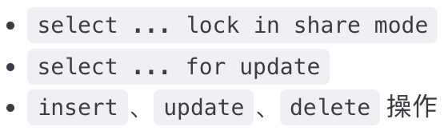
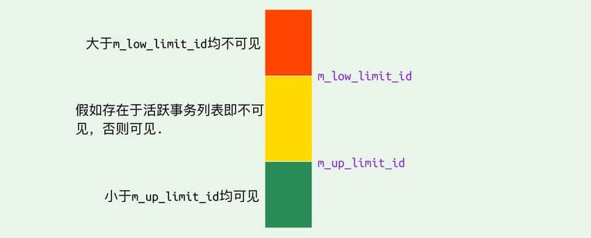

# 一 、MVCC 多版本并发控制 (Multi-Version Concurrency Control)

MVCC 是一种并发控制机制，用于在多个并发事务同时读写数据库时保持数据的一致性和隔离性。它是通过在每个数据行上维护多个版本的数据来实现的。当一个事务要对数据库中的数据进行修改时，MVCC 会为该事务创建一个数据快照，而不是直接修改实际的数据行。

# 1 读操作（SELECT
事务执行读操作时，会使用快照读取。快照 基于事务开始时数据库中的状态创建，因此事务 不会读取 其他事务尚未提交的 修改。

# 2 写操作（INSERT、UPDATE、DELETE）    
一个事务执行写操作时，事务会为要修改的数据行创建一个新的版本，并将修改后的数据写入新版本。

# 3 事务提交和回滚
- 一个事务提交时，它所做的修改将成为数据库的最新版本，并且对其他事务可见
- 一个事务回滚时，它所做的修改将被撤销，对其他事务不可见    

# 4 版本回收
防止版本无限增长，定期回收不在需要的旧版本。  

# 总结
MVCC 通过创建数据的多个版本和使用快照读取来实现并发控制。读操作使用旧版本数据的快照，写操作创建新版本，并确保原始版本仍然可用。这样，不同的事务可以在一定程度上并发执行，而不会相互干扰，从而提高了数据库的并发性能和数据一致性。

# 二、一致性非锁定读和锁定读
## 一致性非锁定读
由MVCC实现

## 锁定读
如果执行的是下列语句，就是 锁定读（Locking Reads）：

锁定读下，读取的是数据的最新版本。

# 三、INNDB 对 MVCC 的实现
**隐藏字段、Read View、undo log**
在内部实现中，InnoDB 通过数据行的 DB_TRX_ID 和 Read View 来判断数据的可见性，如不可见，则通过数据行的 DB_ROLL_PTR 找到 undo log 中的历史版本。每个事务读到的数据版本可能是不一样的，在同一个事务中，用户只能看到该事务创建 Read View 之前已经提交的修改和该事务本身做的修改
## 隐藏字段
- DB_TRX_ID（6字节）Database Transaction ID：表示最后一次插入或更新该行的事务 id。  
此外，delete 操作在内部被视为更新，只不过会在记录头 Record header 中的 deleted_flag 字段将其标记为已删除
- DB_ROLL_PTR（7字节）Database Rollback Pointer： 回滚指针，指向该行的 undo log 。如果该行未被更新，则为空
- DB_ROW_ID（6字节）Database Row ID：如果没有设置主键且该表没有唯一非空索引时，InnoDB 会使用该 id 来生成聚簇索引

## Read View
Read View 是数据库为一次一致性读构建的“快照元数据”，记录在该读发生时哪些事务是活跃的，用于判定哪些行版本对这次读可见。
````c
class ReadView {
  /* ... */
    private:
    trx_id_t m_low_limit_id;      /* 大于等于这个 ID 的事务均不可见 */

    trx_id_t m_up_limit_id;       /* 小于这个 ID 的事务均可见 */

    trx_id_t m_creator_trx_id;    /* 创建该 Read View 的事务ID */

    trx_id_t m_low_limit_no;      /* 事务 Number, 小于该 Number 的 Undo Logs 均可以被 Purge */

    ids_t m_ids;                  /* 创建 Read View 时的活跃事务列表 */

    m_closed;                     /* 标记 Read View 是否 close */
}
````


## undo log
两个作用：
- 事务回滚时用于将数据恢复到修改前的样子
- 另一个作用是 MVCC ，当读取记录时，若该记录被其他事务占用或当前版本对该事务不可见，则可以通过 undo log 读取之前的版本数据，以此实现 （非锁定读）
共有两种：
- insert undo log：插入记录只对自身事务可见，因此可在事务提交后直接删除，无需purge操作。
- update undo log：update 或 delete 操作中产生的 undo log。该 undo log可能需要提供 MVCC 机制，因此不能在事务提交时就进行删除。提交时放入 undo log 链表，等待 purge线程 进行最后的删除。

#
