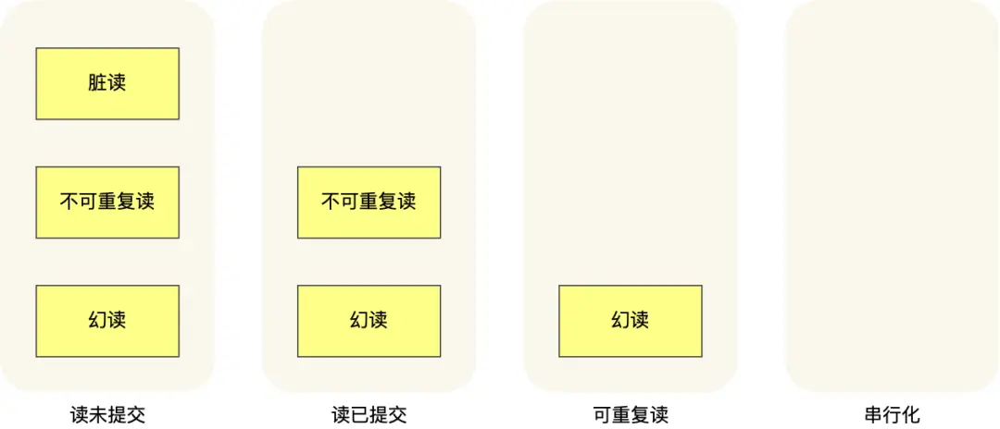

隔离性是通过 MVCC（多版本并发控制） 或锁机制来保证的.
# 1 并发事务带来的问题（严重性由高到低
MySql 允许多个客户端连接，处理多个事务时可能出现脏读（dirty read）、不可重复读（non-repeatable read）、幻读（phantom read）的问题。
## 1.1 脏读
一个事务A「读到」了另一个「未提交事务B修改过的数据」，就意味着发生了「脏读」现象。
其中如果 事务B 发生回滚，那么 事务A 读到的就是 过期数据了。

## 1.2 不可重复读
在一个事务内多次读取同一个数据，如果出现前后两次读到的数据不一样的情况，就意味着发生了「不可重复读」现象。

## 1.3 幻读
在一个事务内多次查询某个符合查询条件的「记录数量」，如果出现前后两次查询到的记录数量不一样的情况，就意味着发生了「幻读」现象。

# 2 事务隔离级别（隔离水平 由低到高
SQL 标准提出了四种隔离级别来规避这些现象，隔离级别越高，性能效率就越低。    
- 读未提交（read uncommitted），指一个事务还没提交时，它做的变更就能被其他事务看到；
- 读提交（read committed），指一个事务提交之后，它做的变更才能被其他事务看到；
- 可重复读（repeatable read），指一个事务执行过程中看到的数据，一直跟这个事务启动时看到的数据是一致的，MySQL InnoDB 引擎的默认隔离级别；
- 串行化，会对记录加上读写锁，在多个事务对这条记录进行读写操作时，如果发生了读写冲突的时候，后访问的事务必须等前一个事务执行完成，才能继续执行；    

# 3 可重复读
‘’‘     
只读同一个已提交版本的记录  
’‘’     
启动事务时生成一个 Read View，整个事务期间都在用这个 Read View。    
新版本记录的 roll_pointer 字段会指向旧版本。参看 Read View 一节[text](MVCC.md)  

# 4 读提交
每次读取数据时，都会生成一个新的 Read View。    
意味着，事务期间的多次读取同一条数据，前后两次读的数据可能会出现不一致，因为可能这期间另外一个事务修改了该记录，并提交了事务。
