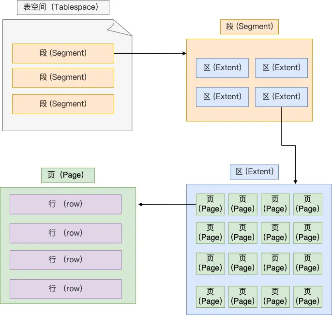
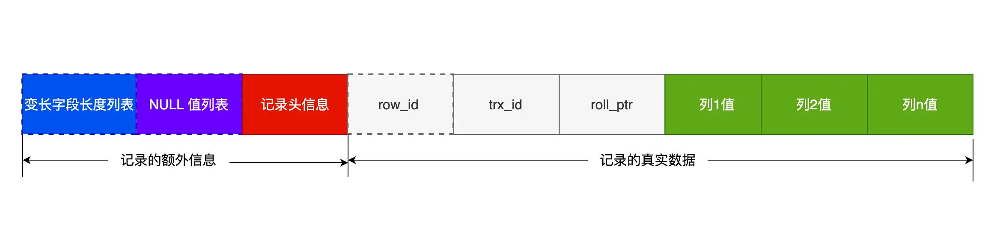
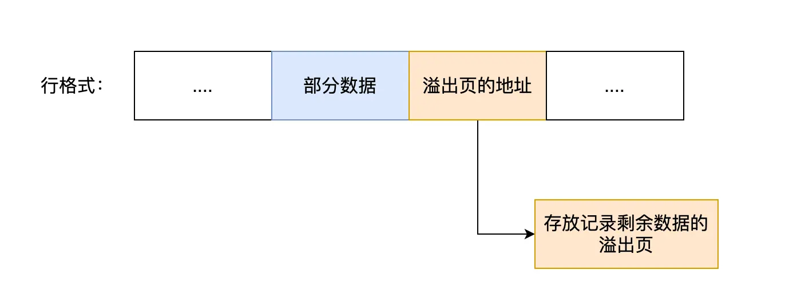
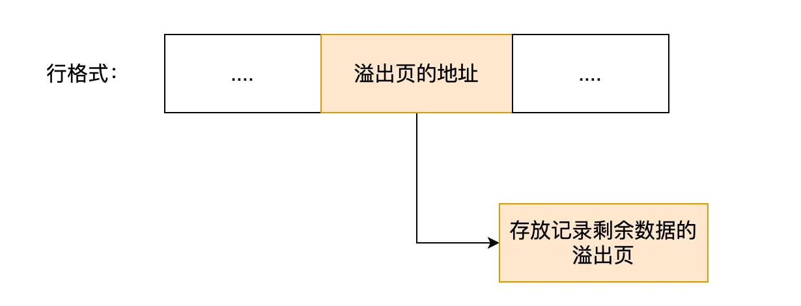

一张数据库表的数据是保存在「 表名字.ibd 」的文件里的，这个文件也称为独占表空间文件。

# 表空间文件的结构
表空间由段（segment）、区（extent）、页（page）、行（row）组成。InnoDB存储引擎的逻辑存储结构大致如下图：

# 页
InnoDB 的数据是按「页」为单位来读写的，因此每次读数据是以页为单位读取，默认每页大小为16KB。  
页是 InnoDB 存储引擎磁盘管理的最小单元，其类型：常见的有数据页、undo 日志页、溢出页等等

# InnoDB 行格式
## Compact 行格式

### 记录（名词） 的额外信息
#### 变长字段长度列表
保存 varchar(n) 中存储 的数据的 实际长度。 
** 其中 n 表示 字符 而非 字节的数量。

#### NULL 值列表
NULL 值放到记录的真实数据中 浪费空间，
所以Compact 行格式把这些值为 NULL 的列存储到 NULL值列表中。  
二进制 为 1 对应列值为 NULL，0 对应不为NULL

当数据表的字段都定义成 NOT NULL 的时候，这时候表里的行格式就不会有 NULL 值列表了。

#### 记录头信息
内容很多，举例重要的几个
- delete_mask ：标识此条数据是否被删除。数据被删除则暂时被标记为 1；
- next_record：指向的是下一条记录的「记录头信息」和「真实数据」之间的位置，记录和记录是通过链表连接的，向左读就是记录头信息，向右读就是真实数据；
- record_type：表示当前记录的类型，0表示普通记录，，1表示B+树非叶子节点记录，2表示最小记录，3表示最大记录。

### 记录 的真实数据
三个隐藏字段，分别为：row_id、trx_id、roll_pointer
#### row_id
若 建表时未指定 主键或唯一约束列，则InnoDB 就会为记录添加 row_id 隐藏字段。
非必须，占用 6 个字节
#### trx_id
事务id，表示这个数据是由哪个事务生成的。 trx_id是必需的，占用 6 个字节。
#### roll_pointer
记录上一个版本的指针。roll_pointer 是必需的，占用 7 个字节。

# 行溢出 时？
一行记录最大能存储 65535 字节的数据，但是这个是包含「变长字段字节数列表所占用的字节数」和「NULL值列表所占用的字节数」。  
一个页的大小一般是 16KB，也就是 16384字节。而 MySQL 中磁盘和内存交互的基本单位是页。  
发生行溢出，多的数据就会存到另外的「溢出页」中。  
真实数据处用 20 字节存储指向溢出页的地址，从而可以找到剩余数据所在的页。

Compressed 和 Dynamic 这两个行格式 与 Compact 的区别在于，前两者都是采用完全的行溢出形式。所有数据都存储在溢出页。
