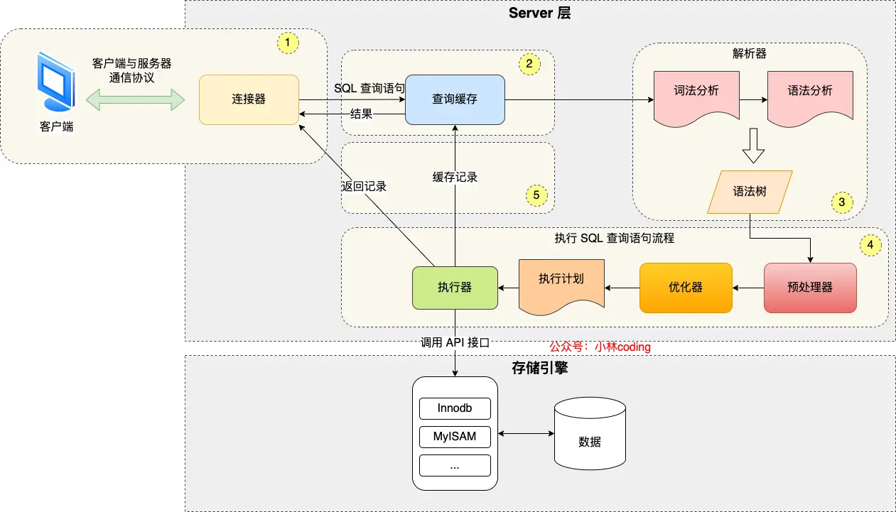
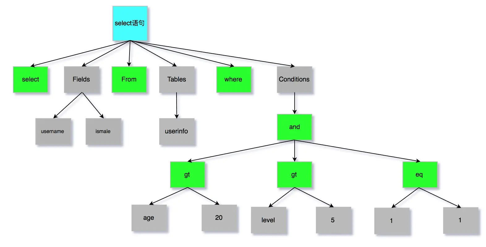

# MySQL 执行一条 SQL 查询语句的流程

## MySql 两层架构
- Server层，负责建立连接、分析和执行SQL
- 存储引擎层，负责数据的存储与提取

## 第一步：连接器
MySql基于TCP，所以需要三次握手

## 第二步：查询缓存（仅限 MySql 8.0 之前的版本）
MySql接收到SQL语句后，解析第一个字段，若是 SELECT 则去缓存中查询。  
缓存以 Key-Value 形式存储在内存中。  
不过对于更新频繁的表，缓存命中概率低，因此 MySql 8 之后就取消了缓存查询这一步。

## 第三步：解析SQL
解析器会做两件事情：
- 词法分析：  
根据输入的 SQL 字符串 识别出关键字

- 语法分析：  
根据 词法分析的结果，语法解析器根据语法规则，判断输入的 SQL 语句 是否符合 MySql 语法，没问题则构建出语法树，方便后面模块获取 SQL 类型、表名、字段名、 where 条件等等。

## 第四步：执行SQL
- prepare
- optimize
- execute

### 预处理器
- 检查SQL 中的表或字段是否存在
- 将 SELECT * 中的 * 扩展为表上的全部字段

### 优化器
基于查询成本的考虑， 选择查询成本最小的执行计划；比如：索引选择

### 执行器
根据执行计划执行 SQL 查询语句，从存储引擎读取记录，返回给客户端