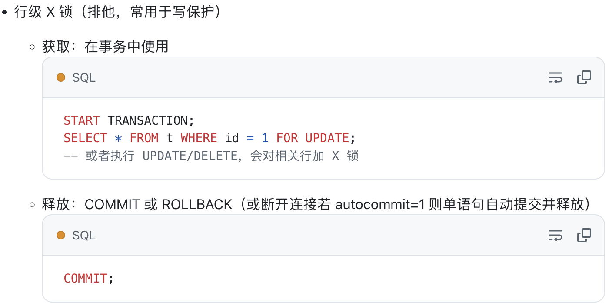
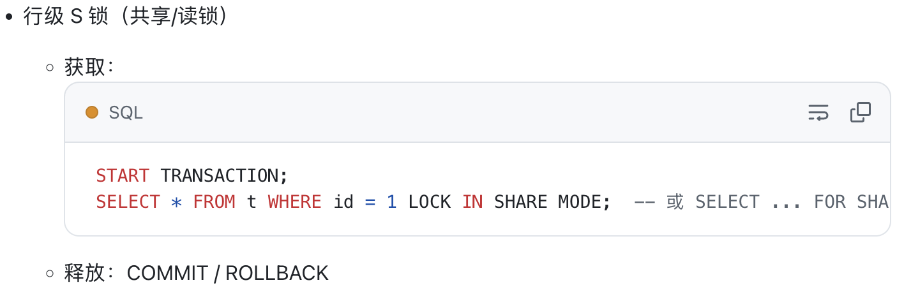

全局锁、表级锁和行锁    
# 全局锁
FTWRL
````sql
flush tables with read lock
````    
执行后，整个数据库就处于只读状态.   
- 释放全局锁，或连接断开
````sql
unlock tables
````
带来的影响主要是业务上的

# 表级锁
包括：表锁、元数据锁（MDL、意向锁、Auto-INC锁
## 表锁
读锁,表级别的共享锁，
````sql
-- 允许当前会话读取被锁定的表，但阻止所有会话对这些表进行写操作
lock tables table_name read;
````
写锁,表级别的独占锁
````sql
-- 允许当前会话对表进行读写操作，但阻止其他会话对这些表进行任何操作（读或写）
lock tables table_name write;
`````
## 元数据锁
表结构层级的锁。  
对一张表进行 CRUD 操作时，加的是 MDL 读锁；     
对一张表做结构变更操作的时候，加的是 MDL 写锁；

不需要显示调用，MDL 是在事务提交后才会释放，这意味着事务执行期间，MDL 是一直持有的。    
申请 MDL 锁的操作会形成一个队列，队列中写锁获取优先级高于读锁，一旦出现 MDL 写锁等待，会阻塞后续该表的所有 CRUD 操作。

## 意向锁
使用 InnoDB 引擎的表里对某些记录加上「共享锁」/「独占锁」之前，需要先在表级别加上一个「意向共享锁」/「意向独占锁」。    
意向锁的目的是为了快速判断表里是否有记录被加锁。

## AUTO-INC 锁
AUTO‑INC 锁用于在高并发插入时保证自增 ID 的分配不会冲突。   
表中主键常为自增，通过对主键字段声明 AUTO_INCREMENT 属性实现。  
此后插入数据，不指定主键的值则会自增添加。通过 AUTO-INC 锁实现。    
插入数据时，会加一个表级别的 AUTO-INC 锁，执行完插入语句后就会立即释放。  

# 3 行级锁
主要有三类：
- Record Lock，记录锁，也就是仅仅把一条记录锁上
- Gap Lock，间隙锁，锁定一个范围，但是不包含记录本身，目的是阻止其他事务向该空隙插入新记录；
- Next-Key Lock：Record Lock + Gap Lock 的组合，锁定一个范围，并且锁定记录本身。

## Record Lock 记录锁
分为 S锁 （Shared，共享锁）和 X锁（Exclusive，独占锁）。    
S（Shared）：多个事务可同时持有，阻止其他事务写。   
X（Exclusive）：只有持有者可以读写，阻止其他事务读/写。 
   

