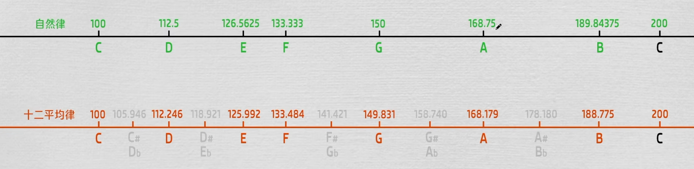

# 音程（Interval）与泛音：从物理到听觉的最短路径

这篇笔记的目标：用最少的概念，把“音程是什么、为什么按频率比来定义、十二平均律怎么来的、纯律和五声音阶怎么联系到一起”讲清楚。

---

## 1. 声音 → 听觉：你需要分清的 3 件事

### 1.1 物理量
- **频率（Hz）**：振动快慢。纯正弦波只有一个频率。
- **振幅**：大致对应响度（还受频率与人耳等响曲线影响）。
- **波形/频谱**：决定音色。

### 1.2 听觉量
- **音高（Pitch）**：人对“高/低”的主观感受，主要由**基频**决定。
- **音色（Timbre）**：同一个音高（同基频）可以有不同音色，关键在于泛音结构与包络。

补充：人耳大致可听范围约 **20 Hz–20 kHz**，但对“说话/人声信息”最敏感的频段通常在几百 Hz 到几 kHz。

### 1.3 钢琴的频率范围（修正）
88 键钢琴的**基频**大约是：
- 最低音 A0：27.5 Hz
- 最高音 C8：约 4186 Hz

如果把泛音也算进去，频谱能延伸到更高频。

---

## 2. 泛音（Harmonics）：为什么同一个音高会“听起来不一样”

大多数真实乐器的声音不是纯正弦，而是：

- **基频** $f_0$：决定你大体听到的音高。
- **泛音/谐波**：频率接近 $2f_0, 3f_0, 4f_0, \dots$ 的成分（整数倍最典型）。

这组接近“整数倍”的频率成分叫**谐波列/泛音列**。它带来两个非常实用的结论：

1) **同一个音高可以有不同音色**：不同乐器在各个谐波上的能量分布不同。
2) **“和谐”与“简单整数比”有关**：两个音的频率比越接近简单整数比（如 2:1、3:2、5:4），往往听起来越融合。

---

## 3. 音程是什么：本质是“频率比”，不是“频率差”

### 3.1 频率差不可靠
- 100→200 Hz 的差是 100 Hz
- 1000→1100 Hz 的差也是 100 Hz

但这两对的“听感音程”明显不同。

### 3.2 频率比更符合听觉
人对音高的主观尺度更接近对数：
- 100→200 Hz 是 **2 倍**（一个八度）
- 200→400 Hz 也是 **2 倍**（同一个八度）

因此音程更稳定的定义方式是：

> 音程 ≈ 两个频率的比值（或其对数）。

### 3.3 音分（cent）：把“比值”转成好用的刻度
常用单位是 **cent**：
- 1 个八度 = 1200 cent
- 12 平均律中 1 个半音 = 100 cent

两个频率 $f_1, f_2$ 的音分差：
$$\text{cents} = 1200\log_2\left(\frac{f_2}{f_1}\right)$$

---

## 4. 纯律（Just Intonation）vs 十二平均律（12-TET）

### 4.1 纯律（常被你写成“自然律”）
纯律的核心不是“每一步乘同一个数”，而是：
- 用**简单整数比**来定义常见音程（来源于泛音列与和声融合感）。

典型比值（示意）：
- 八度：2:1
- 纯五度：3:2
- 大三度：5:4
- 大全音（常见一种）：9:8（约 1.125）

注意：纯律里“全音/半音”并非只有一种大小，不同上下文可能会出现大小略不同的全音/半音。

### 4.2 十二平均律（12-TET）
十二平均律的目的：
- 让你在任意调里转调都“同一套键位/指法/和声逻辑”可用（尤其适合键盘与转调频繁的音乐）。

定义方式：把一个八度（频率比 2:1）平均分成 12 份，每份（一个半音）的固定比值是：
$$2^{1/12} \approx 1.059463$$

相隔 $n$ 个半音的频率比：
$$\frac{f_2}{f_1} = 2^{n/12}$$

它的代价：某些纯律的简单整数比（比如 3:2 的纯五度）会被“轻微调偏”，但换来全调通用。

---

## 5. 七声音阶与五声音阶（宫商角徵羽）怎么用“半音数”理解

### 5.1 大调（七声音阶）的半音结构
大调相邻音级的半音数：
$$2\;2\;1\;2\;2\;2\;1$$

也常写作：全 全 半 全 全 全 半。

### 5.2 大调五声音阶（宫商角徵羽）
如果从大调里去掉 4、7 级（fa、ti），剩下的五声相邻间隔变成：
$$2\;2\;3\;2\;3$$

这就是你写的“全全 1.5全 全 1.5全”（其中 1.5 全音 = 3 半音 = 小三度）。

更准确的说法是：
- 不是“从自然律里减半音”，而是**从七声中删掉两个音级**后，剩余相邻间隔自然变成 2/3 半音的组合。

---

## 6. 一个可复用的例子（建议记住）

以 A4 = 440 Hz 为例：
- 高八度 A5：$440\times2=880$ Hz
- 低八度 A3：$440/2=220$ Hz
- 高一个半音（A#4/Bb4）：$440\times2^{1/12}\approx466.16$ Hz

---

## 7. 图（可选）

如果你要配图讲“纯律 vs 平均律”，建议再补一张：把 3:2（纯五度）和 $2^{7/12}$（12-TET 五度）并排对比，会更直观。